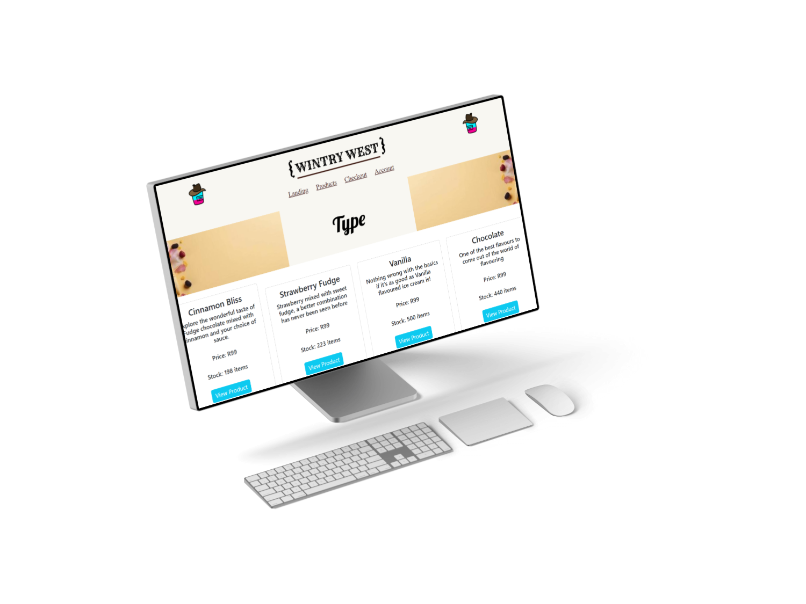
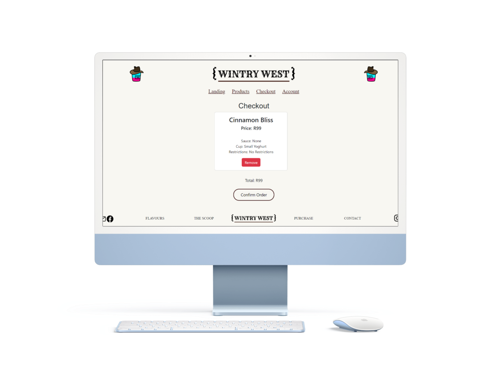
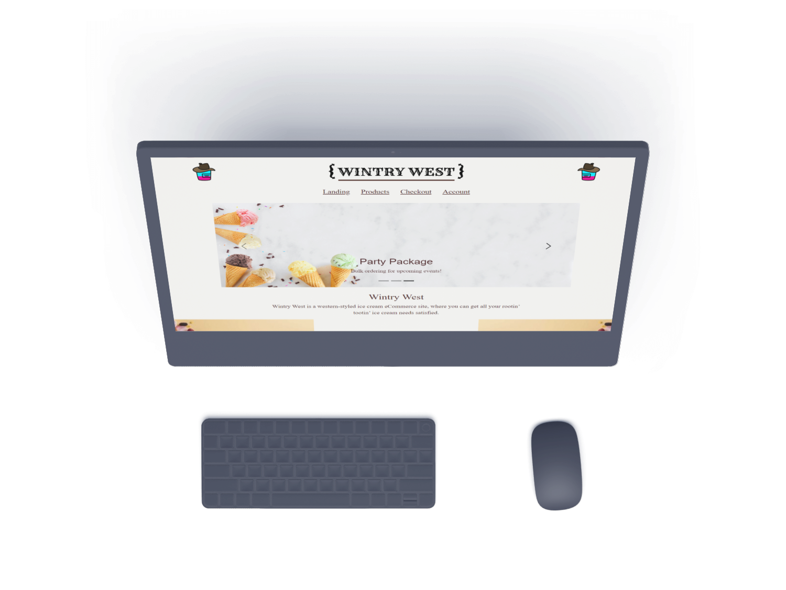

<!-- Project Info -->
<br>


<!-- Logo and link to repository -->
<p align="center">
  <a href="https://github.com/Pantonym/DV200Term3">
    
  </a>
</p>

<!-- Short Description -->
<h3 align="center">Wintry West: No-SQL E-Commerce Store</h3>
<p align="center"> This is an e-commerce website where MongoDB is used to handle orders, carts, users and products.
    <br>
    <!-- Bug and New Feature Links -->
    <a href="https://github.com/Pantonym/DV200Term3/issues">Report Bug</a>
    <a href="https://github.com/Pantonym/DV200Term3/issues">Request Feature</a>
    <br>
</p>

<!-- Name, Number, Subject and Term -->
<h5 align="center" style="padding:0;margin:0;">Nico van Wyk</h5>
<h5 align="center" style="padding:0;margin:0;">Student Number: 221179</h5>
<h6 align="center">DV200 | Term 3</h6>

<!-- TABLE OF CONTENTS -->
## Table of Contents

- [Table of Contents](#table-of-contents)
- [About the Project](#about-the-project)
  - [Mockup](#mockup)
  - [Project Description](#project-description)
  - [Technologies Used](#technologies-used)
  - [Built With](#built-with)
    - [MERN Stack](#mern-stack)
    - [Axios](#axios)
    - [Bootstrap](#bootstrap)
    - [JWT](#jwt)
- [Getting Started](#getting-started)
  - [Prerequisites](#prerequisites)
  - [Installation](#installation)
- [Features and Functionality](#features-and-functionality)
- [Development Process](#development-process)
  - [Architecture](#architecture)
  - [Design Frame](#design-frame)
  - [Solution](#solution)
  - [Theme](#theme)
  - [What was refined?](#what-was-refined)
  - [Development Documents](#development-documents)
    - [Highlights](#highlights)
    - [Challenges](#challenges)
  - [Future Implementation](#future-implementation)
- [Final Outcome](#final-outcome)
  - [Mockups](#mockups)
  - [Video Demonstration](#video-demonstration)
- [License](#license)
- [Author](#author)
- [Contact](#contact)
- [Acknowledgements](#acknowledgements)
- [References](#references)

<!-- About the Project -->
## About the Project

<!-- Mockup -->
### Mockup


<!--PROJECT DESCRIPTION-->
### Project Description
Wintry West is an e-commmerce website that allows an administrator to add, update and delete products and orders. Users can add, update and personalize their orders and cart, as well as delete from each. 
### Technologies Used
* MERN Stack
* Axios
* Bootstrap
* JSON Web Tokens (JWT)

### Built With
<!-- MERN Stack -->
#### MERN Stack
* MongoDB: NoSQL Database used to store the information of the web application.
* Express: A Node.js framework that was used to implement HTTP logic.
* React.js: A JavaScript library used to build the front end of the application.
* Node.js: The environment used to handle the server requests.
<p>The MERN Stack was used to build both the database of the web application, as well as the front end.</p>


<!-- Axios & AJAX -->
#### Axios
* Makes Asynchronous JavaScript and XML (AJAX) easier to implement.
* It is a JavaScript library.
* Enables asynchronous requests.
* Used to implement Create, Read, Update and Delete (CRUD) functionality.
<p>AXIOS implemented the requirements of having charts populated with real data that can change asynchronously.</p>


<!-- Bootstrap -->
#### Bootstrap
* Provides CSS frameworks for the implementation of responsive user experience designs.
* Used to implement the front end of the application.
<p>Bootstrap implemented the requirements of having a responsive, professional design.</p>


<!-- JWT -->
#### JWT
* JWT (JSON Web Tokens) is a form of authorization to prove that a user may use certain functionalities. Different types of tokens can be granted for different users to change which models and routes they can access.
<p>JWT was used to increase authorization once a user is logged in.</p>


<!-- GETTING STARTED -->
## Getting Started
These instructions will get you a copy of the project up and running on your local machine for development and testing purposes.

### Prerequisites
For development and testing, a React App is required (`Terminal --> New Terminal --> npx create-react-app appName`). This should download the most recent version of React. In addition, the latest version of Node.js is required, which is available here: [Node.js](https://nodejs.org/en)

### Installation
Here are a couple of ways to clone this repo:

1.  GitHub Desktop </br>
    Enter `https://github.com/Pantonym/DV200Term3.git` into the URL field and press the `Clone` button.

2.  Clone Repository </br>
    Run the following in the command-line to clone the project:

    ```sh
    git clone https://github.com/Pantonym/DV200Term3.git
    ```
The following installations are required if you do not clone the repository:
* Click on Terminal and open a new terminal
* Type the following:
1. cd appName
2. npm i axios
3. npm i react-router-dom
4. npm i bootstrap react-bootstrap
5. cd serverName
6. npm i nodemon cors multer express mongodb dotenv mongoose
7. npm start
* To close the app: `ctrl+c`, `Y` in the terminal.

<!-- Main Features and Functionality -->
## Features and Functionality
1. Log in and Authenticate users - Create a user account
* A function is used to gather data submitted by the user. The data is automatically validated through the input types, and is stored to useStates. An Axios.post is used to create the new user.
`const SignUpSubmit = async (e) => {`
`// --stops the page from refreshing on submit`
`e.preventDefault();`
`try {`
`  const URLAdd = "http://localhost:5000/api/addUser/";`
`  let payload = {`
`    username: username,`
`    email: email,`
`    password: pass`
`    }`
`  Axios.post(URLAdd, payload)`
`  var data = { email: email, password: pass }`
`  const URL = "http://localhost:5000/api/loginUser";`
`  const { data: res } = await Axios.post(URL, data);`
`  // --Save the email to localStorage (for changing the navbar)`
`  sessionStorage.setItem("Email", email);`
`  // --Save token to localStorage`
`  sessionStorage.setItem("token", res.data);`
`  // --Return to the home page`
`  window.location = "/";`
`  } catch (error) {`
`  // --return the error`
`  if (error.response && error.response.status >= 400 && error.response.status <= 500) {`
`  setError(error.response.data.message);`
`}}}`

2. Log in and Authenticate users - Log in with an account
* A function is used to post the data submitted by the user to the users.js Route, where a JWT token is generated if the user data is correct. The token is then sent to session storage.
`const LoginSubmit = async (e) => {`
`  // --stops the page from refreshing on submit`
`  e.preventDefault();`
`  try {`
`    var data = { email: email, password: pass }`
`    const URL = "http://localhost:5000/api/loginUser";`
`    const { data: res } = await Axios.post(URL, data);`
`    // --Save the email to localStorage (for changing the navbar)`
`    sessionStorage.setItem("Email", email);`
`    // --Save token to localStorage`
`    sessionStorage.setItem("token", res.data);`
`    // --Return to the home page`
`    window.location = "/";`
`  } catch (error) {`
`    // --return the error`
`    if (error.response && error.response.status >= 400 && error.response.status <= 500) {`
`    setError(error.response.data.message);`
`}}}`

3. Log in and Authenticate users - Showcase your implementation of JWT
* The token is generated within the users.js Route using the generateAuthToken() method. It is then returned to the client side to be stored to session storage.
`// ----Test if the password is the same as the one in the database`
`  if (findUser.password === req.body.password) {`
`  console.log("User Logged in");`
`  // ------Generate a JWT.`
`  const token = findUser.generateAuthToken();`
`  // ------Return the JWT to the Client folder (term3) so it can be saved to localStorage. This is done because you cannot save to localStorage in the server folder.`
`  res.status(200).send({ data: token, message: "logged in successfully" });`
`} else {`
`  res.send("Email and password does not match");`
`  console.log("Email and password does not match");`
`}`

4. Landing Page - Showcase a slider of your products
* The slider is a Bootstrap Carousel element that is populated with three different items.
`<Carousel className="carousel-dark">`
`  {/* ------Carousel Items */}`
`  <Carousel.Item interval={10000}>`
`      `
`    <Carousel.Caption>`
`      <h3 className="brown Lobster CarouselHeading">Neapolitan</h3>`
`      <p className="brown Abel CarouselText">Strawberry, Chocolate and Vanilla - an unbeatable combo!</p>`
`    </Carousel.Caption>`
`  </Carousel.Item>`
`  <Carousel.Item interval={10000}>`
`      `
`    <Carousel.Caption>`
`      <h3 className="brown Lobster CarouselHeading">Strawberry Cup</h3>`
`      <p className="brown Abel CarouselText">A cup of flavorful strawberry ice cream, with a free strawberry cone!</p>`
`    </Carousel.Caption>`
`  </Carousel.Item>`
`  <Carousel.Item interval={10000}>`
`      `
`    <Carousel.Caption>`
`      <h3 className="brown Lobster CarouselHeading">Party Package</h3>`
`      <p className="brown Abel CarouselText">Bulk ordering for upcoming events!</p>`
`    </Carousel.Caption>`
`  </Carousel.Item>`
`</Carousel>`

5. Landing Page - Show new and discounted products
* The elements are populated within a useEffect and assigned to a useState.
`{newProducts}`
`{discountProducts}`
`// Discounted Products`
`Axios.get('http://localhost:5000/api/products_get_all/')`
`.then(res => {`
` let productData = res.data;`
` let renderProducts = productData.map((item) =>`
` <DiscountCard key={item._id} id={item._id} name={item.name} description={item.description} price={item.price} stock={item.stock} tagline={item.tagline}`
` choco={item.variations.sauce.chocolate} vanil={item.variations.sauce.vanilla} cara={item.variations.sauce.caramel}`
` yogsmall={item.variations.cone.yoghurt.small} yogmed={item.variations.cone.yoghurt.medium} yoglarge={item.variations.cone.yoghurt.large}`
` wafsmall={item.variations.cone.waffle.small} wafmed={item.variations.cone.waffle.medium} waflarge={item.variations.cone.waffle.large}`
` bucksmall={item.variations.cone.bucket.small} buckmed={item.variations.cone.bucket.medium} bucklarge={item.variations.cone.bucket.large}`
` image={item.image}`
` />)`
` setDiscountProducts(renderProducts);`
` setReRenderProducts(false);`
`})`
`.catch(err => console.log(err))`

6. Product Page - Show all products
* The products are received using an Axios.get statement, and then they are mapped to the ProductCard component. They are rendered using a useState to update.
`Axios.get('http://localhost:5000/api/products_get_all/')`
`.then(res => {`
`  let productData = res.data;`
`  console.log(productData);`
`  let renderProducts = productData.map((item) =>`
`    <ProductCard key={item._id} id={item._id} name={item.name} description={item.description} price={item.price} stock={item.stock} tagline={item.tagline}`
`    choco={item.variations.sauce.chocolate} vanil={item.variations.sauce.vanilla} cara={item.variations.sauce.caramel}`
`    yogsmall={item.variations.cone.yoghurt.small} yogmed={item.variations.cone.yoghurt.medium} yoglarge={item.variations.cone.yoghurt.large}`
`    wafsmall={item.variations.cone.waffle.small} wafmed={item.variations.cone.waffle.medium} waflarge={item.variations.cone.waffle.large}`
`    bucksmall={item.variations.cone.bucket.small} buckmed={item.variations.cone.bucket.medium} bucklarge={item.variations.cone.bucket.large}`
`    image={item.image}`
`  />)`
`  setProducts(renderProducts);`
`})`
`.catch(err => console.log(err))`

7. Individual Page - Show details of an individual item
* The id of the item that has been clicked on is saved to localStorage, where it is then added to the Axios statement to receive the details of the individual item. 
`Axios.get('http://localhost:5000/api/product_get_single/' + localStorage.getItem("SingleItem"))`
`.then(res => {`
`  let varData = res.data;`
`  // image displaying`
`  const serverURL = 'http://localhost:5000';`
`  const imageURL = '${serverURL}/images/${varData.image}';`
`  sessionStorage.setItem("imageURL", imageURL);`
`  sessionStorage.setItem("ProductName", varData.name);`
`  sessionStorage.setItem("Image", varData.image);`
`  sessionStorage.setItem("ProductPrice", varData.price);`
`  sessionStorage.setItem("ProductDesc", varData.description);`
`  sessionStorage.setItem("ProductID", varData.id);`
`})`
`.catch(err => console.log(err))`

8. Show you can add items to a cart
* A function is used on an onClick event to send the data to the orders model.
`const AddToCart = (id) => {`
`  let TotalPrice = document.getElementById("sedQty").value * sessionStorage.getItem("ProductPrice");`
`  if (document.getElementsByName("Restrictions").value === undefined) {`
`    var RESTRICTIONS = 'NoRes';`
`  }`
`  let ORDERS = sessionStorage.getItem("ProductName") + ', ' + sessionStorage.getItem("ProductPrice") + ', ' + document.getElementById("SelectFlavours").value + ', ' + document.getElementById("SelectSize").value + ', ' + document.getElementById("SelectType").value + ', ' + RESTRICTIONS + ', ' + document.getElementById("sedQty").value;`
`  let payload = {`
`    client: sessionStorage.getItem("Email"),`
`    orders: ORDERS,`
`    totalprice: TotalPrice`
`  }`
`  if (sessionStorage.getItem("Email") === null) {`
`    window.location = "/signup";`
`  } else {`
`    console.log(payload);`
`    if (window.confirm("Are you sure you want to add this to your cart?") === true) {`
`      Axios.post('http://localhost:5000/api/order_add/', payload);`
`    }`
`  }`
`}`

9. Cart Page - Show all items added to a cart, delete items from the cart
* All items are shown through a useEffect and an Axios.get statement, similarly to how it is on other pages. Whenever the cart is changed, it must re-render.
`useEffect(() => {`
`  Axios.get('http://localhost:5000/api/order_get_all/')`
`  .then(res => {`
`    let orderData = res.data;`
`    let renderProducts = orderData.map((item) =>`
`      <Cart key={item._id} id={item._id} client={item.client} orders={item.orders} totalprice={item.totalprice} />)`
`    setOrders(renderProducts);`
`    setReRenderProducts(false);`
`    })`
`  .catch(err => console.log(err))`
`}, [reRenderProducts])`
* Deleting items is handled in the cart.js component through an onclick event that passes the specific item's id through:
`const RemoveItem = (e) => {`
`  let URL = 'http://localhost:5000/api/order_delete/' + e;`
`  Axios.delete(URL)`
`  .then(res => {`
`    alert('Item Deleted');`
`    window.location.reload(false);`
`  })`
`  .catch(err => console.log(err))`
`  console.log(URL);`
`}`

10.  Check out functionality - Checkout an order
* When the order is completed, and the relevant checkout information is supplied, the order will be sent to the administrator page:
`OrderSubmit = (e) => {`
`  let NAME = document.getElementById('inpName').value;`
`  let ADDRESS = document.getElementById('inpAddress').value;`
`  let ORDER = '1x ' + localStorage.getItem('OrderName');`
`  let payload = {`
`    clientName: NAME,`
`    clientAddress: ADDRESS,`
`    orderName: ORDER`
`  }`
`  Axios.post('http://localhost:5000/api/placedorder_add/', payload);`
`  document.getElementById("ConfirmOrder").style.display = 'none';`
`  alert('Order Confirmed');`
`}`

11.  Administrator functions - When logged in as an admin: Add, edit and remove a product
* Adding a product is done through a hidden form that is shown when the user clicks the `AddProduct` button. The inputs are collected, normalized, and sent to the database.
`const AddProduct = (e) => {`
`  // Normalize the variation items`
`  const normalizeVariation = (value) => (value === undefined ? 0 : parseInt(value));`
`  let STOCK = (+variationConeYoghurtLarge + +variationConeYoghurtMedium + +variationConeYoghurtSmall) + (+variationConeWaffleLarge + +variationConeWaffleMedium + +variationConeWaffleSmall) + (+variationConeBucketLarge + +variationConeBucketMedium + +variationConeBucketSmall);`
`  const data = {`
`    name: productName,`
`    tagline: productTagLine,`
`    description: productDesc,`
`    price: parseFloat(productPrice),`
`    stock: STOCK,`
`    variations: {`
`      sauce: {...},`
`      cone: {`
`        yoghurt: {...},`
`        waffle: {...},`
`        bucket: {...}`
`      }`
`    }`
`  };`
`  const payload = new FormData();`
`  payload.append('data', JSON.stringify(data));`
`  payload.append('image', image);`
`  // If the user left out an item`
`  if (!productName || !productTagLine || !productDesc || !productPrice) {...`
`  } else {`
`    Axios.post('http://localhost:5000/api/product_add', payload, {headers: {'Content-Type': 'multipart/form-data', // Set the correct content type for FormData},`
`  }).then((response) => {`
`  // Handle the response from the server`
`  console.log(response.data);`
`  }).catch((error) => {console.error(error)})`
`  ...`
`}}`
* Editing a product is handled in the StockCard.js component. It is completed using an Axios.patch statement.
`const UpdateFunc = (e) => {`
`  let URL = 'http://localhost:5000/api/product_update/' + e;`
`  // Basic Info`
`  setProductName(document.getElementById("name_change_" + e).value);`
`  ...`
`  let STOCK = (...);`
`  let payload = {...}`
`    const objFormData = new FormData();`
`    objFormData.append('data', JSON.stringify(payload));`
`    objFormData.append('image', image);`
`      Axios.patch(URL, objFormData, {headers: {'Content-Type': 'multipart/form-data', // Set the correct content type for FormData},})`
`      .then((response) => {`
`      // Handle the response from the server`
`        console.log(response.data);`
`      })`
`      .catch((error) => {`
`      // Handle any errors`
`        console.error(error);`
`      });`
`    window.location.reload(true);`
`  }`
`}`
* Deleting is also handled in the StockCard.js component. The window is reloaded once the item is deleted to refresh the stock cards and show it has been removed.
`const DeleteFunc = (e) => {`
`  let URL = 'http://localhost:5000/api/product_delete/' + e;`
`  Axios.delete(URL)`
`  .then(res => {`
`    alert('Item Deleted');`
`    window.location.reload(false);`
`  })`
`  .catch(err => console.log(err))`
`  console.log(URL);`
`}`

12.  Administrator functions - When logged in as an admin: View and dispatch orders created
* The order cards are populated using a map function inside of a useEffect similar to how the other card components are displayed. To dispatch the item, an onclick event is used that uses an axios.delete statement to remove the order as it is no longer necessary to keep in the database.
`const DeleteFunc = (e) => {`
`  let URL = 'http://localhost:5000/api/placedorder_delete/' + e;`
`  Axios.delete(URL)`
`  .then(res => {`
`    alert('Item Deleted');`
`    window.location.reload(false);`
`  })`
`  .catch(err => console.log(err))`
`  console.log(URL);`
`}`

<!-- Development PROCESS -->
## Development Process
### Architecture
The application consists of multiple react pages and components. It communicates with a NoSQL database to receive and send information. `Axios` was used to contact `MongoDB`to create the database used in this project, as well as the application `Insomnia` to test the functionality.
### Design Frame
How might we create a solution to the problem of needing an online web application that hosts an e-commerce store that manages user and product data, including order information, through a No-SQL database?
### Solution
The Wintry West application, which can Create, Read, Update and Delete (CRUD) entries in a No-SQL Database for users, products and order data.
### Theme
I chose a Western-themed website to create a contrast between selling cold products and the generic idea of a western theme, which usually includes warm climates. It also follows a very limited font and colour scheme to keep visuals consistent across pages and user types. I chose a mixture of light and dark browns to evoke the western theme, however I added red, blue and green to highlight important elements so they do not fade into the background. I worked with lecturers in contact sessions and class to get feedback on improvements and other implementation ideas.
### What was refined?
1. The login function was updated to use SessionStorage so it would remain consistent across multiple pages.
2. Missing functionality: Image uploading, creation and updating was added.
3. Missing functionality: Image displaying was added.

### Development Documents
<!-- Object Mapping -->
* Object Mapping


<!-- Use Case Diagram -->
* Use Case Diagram


<!-- Data Flow Diagram -->
* Data Flow Diagram


<!-- Wireframes -->
* Wireframes
Landing Page

Single Product Page

Products Page

Checkout Page

Administrators Page


<!-- Highlights -->
#### Highlights
* A great highlight was when the Axios calls finally started to work through the Client folder (term3). 
* Understanding the process of working through Axios to change data on MongoDB was a great pain until, all at once, it snapped and I knew that I had to do, which was rewarding.
* Revisiting React was also interesting as it has interesting ways to communicate through pages.

<!-- Challenges -->
<!-- Explain the challenges faced with the project and why you think you faced it or how you think you'll solve it (if not solved), or how you solved it -->
#### Challenges
* The largest issue I had was understanding how to properly communicate between the server and client folders. I solved this issue by watching the videos supplied to us, as well as experimenting by myself to understand how the different folders can communicate.
* The codebase is also too scattered - there are no unified files meaning several components do the same thing, just changed slightly. This means that a lot of code is repeated across the codebase, even though nothing is repeated for no reason.
* JSON Web Tokens were also a struggle to understand at first, but I created a personal project to test how it could be done and how it works so I could learn to understand it.
* Axios not updating in time was also a large struggle to overcome, which I did by forcing it to wait at several stages.
* Image uploading was also an extreme challenge, but by joining a contact session and using different debugging methods, I implemented it successfully.

<!-- Future Implementation -->
### Future Implementation
* Potential redesigns of the website.
* Potentially adding more than one administrator.
* I would also like to make the website completely responsive.

<!-- Final Outcome -->
## Final Outcome
<!-- MOCKUPS -->
### Mockups




<br>

<!-- Video Demonstration -->
### Video Demonstration
**Video Demonstration:** <a href="https://drive.google.com/file/d/1foJylM-jxLxU3r0L6Qrze68wZmL4dIYr/view?usp=sharing">Google Drive Link</a>

<!-- LICENSE -->
## License
Distributed under the MIT License. See `LICENSE` for more information.

<!-- AUTHORS -->
## Author
* **Nico van Wyk** - [Github](https://github.com/Pantonym)

<!-- Contact -->
## Contact
**Nico van Wyk** - [221179@virtualwindow.co.za](mailto:221179@virtualwindow.co.za)
* **Project Link** - https://github.com/Pantonym/DV200Term3

<!-- ACKNOWLEDGEMENTS -->
<!-- all resources that you used and Acknowledgements here -->
## Acknowledgements
* [Lecturer](https://github.com/TsungaiKats)
* [Figma](https://www.figma.com/)
* [W3Schools](https://www.w3schools.com)

## References
* https://blog.nextideatech.com/how-to-get-started-with-the-mern-stack-a-comprehensive-guide/ (MERN Stack Logo Image)
* https://www.geekboots.com/story/ajax-and-its-usability-in-web-development (AJAX Logo Image)
* https://blog.openreplay.com/integrating-axios-with-react-hooks/ (AXIOS Logo Image)
* https://tms-outsource.com/blog/posts/bootstrap-alternatives/ (Bootstrap Logo Image)
* https://www.google.com/imgres?imgurl=http%3A%2F%2Fjwt.io%2Fimg%2Flogo-asset.svg&tbnid=gYJwlRewMKTXAM&vet=12ahUKEwja647A4fqBAxVwQaQEHRwdCiUQMygAegQIARBu..i&imgrefurl=https%3A%2F%2Fjwt.io%2F&docid=_x67Q6QQDh7vUM&w=400&h=201&q=jwt&client=opera-gx&ved=2ahUKEwja647A4fqBAxVwQaQEHRwdCiUQMygAegQIARBu (JWT Logo Image)